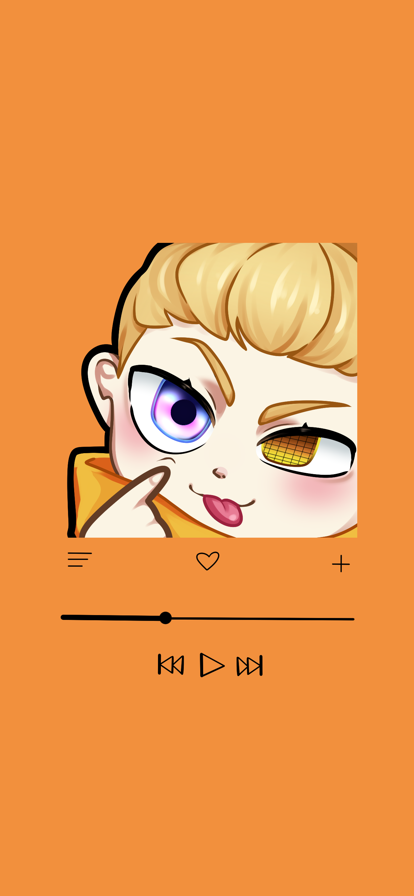

# emotes

hoping to make this a "living document (tm)" of all the emotes I want to commission. the idea being to only ever add to it and mark things that have been commissioned as complete. 

## list 

- [x] [mlem](emotes.md#mlem) 
- [x] [copium](emotes.md#copium)
- [x] [note](emotes.md#note) 
- [x] [peek](emotes.md#peek) 
- [ ] [head pats](emotes.md#head%20pats) 
- [x] [wicked](emotes.md#wicked) 
- [x] [hydrate](emotes.md#hydrate) 

## mlem

based on the phone background thingy below. just the thing from the middle of it. pretty self explanatory. 

## copium 

copium, but with Turing doing the coping. 

 

## note 

Turing looking over a notebook with a pencil. you can only see the top half of the pencil (since it's writing in the notebook). about half of Turing's face is obscured by the notebook. **can send a ref, but I'll have to do it in discord, remind me if I forget.** 

## peek 

thinking of going with the peeking in from one side as opposed to peeking up from the bottom. I think these are pretty standard but here is a ref of what I mean by "in from the side". 

 

## head pats 

the kind that uses this gif. would be animated. ig I'll have to provide a bust shot of Turing for this one too. a ref of Turing can be found [here](./img/turing.jpg). was going to crop it for the emote, but I wasn't really sure where to put the crop, so I just added the whole thing. 

 

## wicked 
this but with Turing wearing a pair of sunglasses like the ones below. mostly just using the sunglasses in the second pic as a color reference. I think the major things to capture here are pose for Turing and the color swap for the glasses. the frames for those glasses can be either the typical wicked style or something more like the ones shown below. 

 

## hydrate

Turing chugging sum water. should look like he's really taking that water to the mouth. 